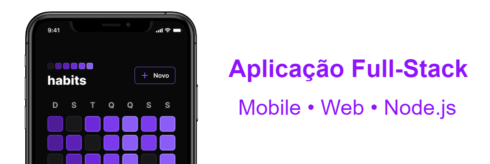
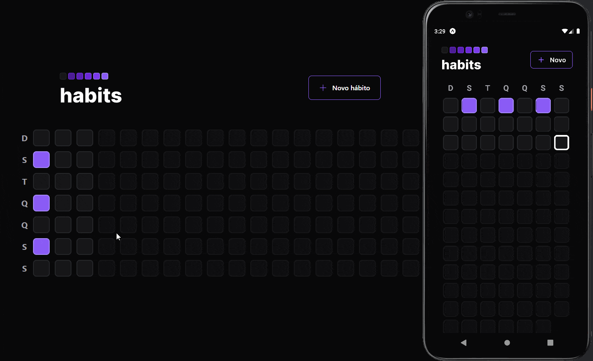

# Habits • Rastreador de hábitos `<NLW Setup/>`


## Índice

- [Sobre](#sobre)
- [Aulas](#aulas)
- [Referência da API](#referência-da-api)
- [Demonstração da aplicação completa](#demonstração-da-aplicação-completa)
- [Instalação](#instalação)
- [O próximo nível](#o-próximo-nível)
- [Contribuição](#contribuição)
- [Licença](#licença)

## Sobre

**habits** é um aplicativo projetado para ajudar você a rastrear seus hábitos e melhorar sua qualidade de vida. Com ele, você pode criar uma lista de hábitos que deseja incorporar em sua rotina diária e marcá-los a medida que os pratica.

O aplicativo apresenta um quadro diário que mostra a frequência dos hábitos praticados, permitindo que você veja sua progresso ao longo do tempo e se motive a seguir em frente.

## Aulas

<details>
  <summary>16/01/2023 • <b>Iniciando o projeto de ponta a ponta</b></summary>
    Foi ensinado de forma rápida a base dos 3 apps que serão desenvolvidos. Logo no início foi apresentado a configuração do servidor com a biblioteca fastify, em seguida a criação com projeto React com Vite e o uso do Tailwind e por último, a criação e configuração do app mobile com Expo e React Native.
</details>

<details>
  <summary>17/01/2023 • <b>Avançando o back-end e front-end</b></summary>
    Foi ensinada a criação de rotas no backend e também a validação de dados com zod e integração ao banco de dados com prisma. No Frontend foi criado novos componentes e ensinado técnicas para lidar com datas e resolver dificuldades específicas do projeto. Por último no app mobile, a utilização do Nativewind para estilização como a do Tailwind na web, também foram adicionados componentes novos e reaproveitado algumas funções da web para lidar com datas.
</details>

<details>
  <summary>18/01/2023 • <b>Finalizando o layout web e mobile</b></summary>
    Foram concluídas as últimas duas rotas do backend e ensinado o momento certo de se compor query SQL a mão. No frontend foi ensinado o uso da biblioteca Radix-UI para criação de componentes com acessibilidade pré configurada e técnicas para estilização com classes condicionais usando o pacote clsx. Por último no app mobile foi ensinado a criação de novas telas e a navegação usando o React Navigator, também foi ensinado a passar propriedades por contexto entre rotas.
</details>

<details>
  <summary>19/01/2023 • <b>Conectando a API</b></summary>
    Nessa aula o foco foi nos dois projetos frontend, web e mobile. Foi ensinado a buscar dados da API construída no backend usando o useEffect e axios, assim como a transmissão de dados do formulário para a API e toda a integração dos dados recebidos para compor a interface do app web. No app mobile foi feito um processo muito semelhante onde os dados do backend foram conectados com a interface e as informações do formulário de criação de hábito transmitidas para API.
</details>

<details>
  <summary>20/01/2023 • <b>O próximo nível</b></summary>
    Foi concluída toda a integração dos dados com a lista de hábitos exibida no gráfico diário tanto da web, quanto do mobile. Também foram feitas algumas modificações no estilo e animações para que as operações que fossem apresentadas de forma suave.
</details>



---

## Referência da API

**Obter o resumo dos hábitos**

```bash
GET /summary
```

**Obter os hábitos possíveis referente a uma data**

```bash
GET /day?{date}

# /day/2023-01-20T14:00:00.000Z
```

| Parâmetro | Tipo               | Descrição                   |
| :-------- | :----------------- | :-------------------------- |
| `date`    | `Date (ISOString)` | Data dos possíveis hábitos. |

**Alternar o estado de um hábito específico**

```bash
PATCH /habits/{id}/toggle

# /habits/67961b77-5096-4b1b-96aa-d21bb949172b/toggle
```

| Parâmetro | Tipo            | Descrição                             |
| :-------- | :-------------- | :------------------------------------ |
| `id`      | `string (UUID)` | Id do hábito a ter o estado alternado |

**Criar um hábito**

```bash
POST /habits

# Corpo em JSON
# {
#   "title": "Beber 2L de água",
#   "weekDays": [0, 2, 4]
# }
```

| Chave      | Tipo       | Descrição                                   |
| :--------- | :--------- | :------------------------------------------ |
| `title`    | `string`   | Título do hábito a ser criado               |
| `weekDays` | `number[]` | Array numérico referente aos dias da semana |

## Demonstração da aplicação completa



## Instalação

> **Note**
> Esse projeto está configurado como um monorepo e as dependências são gerenciadas pelo PNPM.

### Configuração inicial

Clone o repositório e instale as dependências.

```bash
git clone https://github.com/mateusabelli/nlw-setup

cd nlw-setup

pnpm install
```

### Variáveis ambiente

Crie um arquivo .env em `/apps/server/.env` e cole o seguinte código:

```bash
DATABASE_URL="file:./dev.db"
```

### Banco de dados

Com o arquivo .env criado na raiz do `server` rode o seguinte comando:

```bash
pnpm --filter server exec prisma migrate dev
```

> **Warning**
> O comando `prisma generate` possuí uma falha APENAS na etapa da geração da imagem ERD.svg mas funciona normalmente na geração do PrismaClient.

### Modificando o IP local ou porta

Altere de acordo com o seu endereço local, os seguintes arquivos:

- [axios.ts](./apps/web/src/lib/axios.ts) (web)
- [axios.ts](./apps/mobile/src/lib/axios.ts) (mobile)
- [server.ts](./apps/server/src/server.ts) (server)

```diff
# server.ts

- app.listen({ port: 3001, host: "10.0.0.104" })
+ app.listen({ port: 3333, host: "0.0.0.0" })

# axios.ts

- baseURL: "http://10.0.0.104:3001",
+ baseURL: "http://0.0.0.0:3333",
```

### Como utilizar os comandos no monorepo

```bash
pnpm --filter [APP] [COMANDO]

# Exemplo
pnpm --filter web dev
pnpm --filter mobile start
pnpm --filter server dev
```

### Como instalar dependências e executar pacotes

```bash
pnpm --filter [APP] install [PACOTE]
pnpm --filter [APP] exec [PACOTE] [COMANDO]

# Exemplo de instalação
pnpm --filter web install dayjs

# Exemplo de execução de pacote
pnpm --filter server exec prisma studio
```

## O próximo nível

- [ ] Autenticação de usuários (**Em andamento**)

  - 23/01 Estudando monorepo com PNPM e criação de um backend Node.js com rotas de autenticação usando tRPC e JWT com refreshToken via cookies httpOnly

- [ ] Notificações Push / Service Workers
- [ ] Perfil público com gráfico de resumo

## Contribuição

Contribuições são sempre bem-vindas! Se você tem alguma ideia para melhorar o projeto, por favor, abra uma issue ou envie um pull request.

## Licença

Este projeto está licenciado sob a licença **MIT**. Por favor, leia o arquivo [LICENSE.md](./LICENSE.md) para mais informações.
